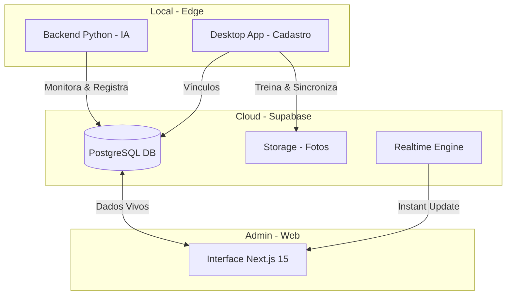

# 🏫 Escola Modelo: Sistema Inteligado de Reconhecimento Facial


O **Escola Modelo** é uma plataforma de segurança e gestão escolar de última geração. O sistema utiliza **Inteligência Artificial e Visão Computacional** para automatizar o controle de fluxo de alunos, garantindo segurança em tempo real e mantendo os responsáveis informados.

---

## 🏗️ Arquitetura do Ecossistema

O projeto é composto por três núcleos independentes que se comunicam via nuvem:



---

## 🖥️ Módulos do Sistema

### 1. Backend: O Cérebro (Python + OpenCV)
Localizado em `/backend`, é responsável pela "visão" do sistema.

*   **`reconhecimento.py` (IA Online)**:
    *   **Performance**: Processa o feed de vídeo com escala reduzida (0.25x) para garantir 30+ FPS.
    *   **Precisão**: Utiliza o modelo HOG (Histogram of Oriented Gradients) via `face_recognition`.
    *   **Lógica Anti-Duplicidade**: Implementa um **cooldown de 30 segundos** por aluno, evitando que uma única passagem gere múltiplos registros.
    *   **Identificação**: Compara a biometria facial capturada com os encodings gerados no cadastro.

*   **`database.py` (Orquestrador de Dados)**:
    *   Integração total com a API do **Supabase**.
    *   **Automação de Fluxo**: Decide automaticamente se o aluno está "Entrando" ou "Saindo" verificando o histórico (`entrada` -> `saida` -> `entrada`).

*   **`app_cadastro.py` (Onboarding Desktop)**:
    *   Interface construída em **Tkinter**.
    *   **Treinamento**: Captura uma sequência de **10 fotos** em diferentes ângulos para garantir que a IA reconheça o aluno mesmo com mudanças sutis.
    *   Sincroniza automaticamente com o **Supabase Storage**.

---

### 2. Frontend: O Painel de Controle (Next.js 15 + React 19)
Localizado em `/frontend`, oferece uma experiência de usuário premium e intuitiva.

*   **Dashboard Inteligente**:
    *   Métricas resumidas (Total de Alunos, Responsáveis, Registros do Dia).
    *   Gráficos interativos de atividade semanal via **Recharts**.
    *   Feed de últimos registros atualizado em tempo real.

*   **Gestão de Entidades**:
    *   Lista de alunos com filtros avançados.
    *   Gestão de responsáveis e vínculos.
    *   Histórico individual de acesso de cada estudante.

*   **Design System Moderno**:
    *   **Estética Arredondada**: Uso da fonte **Outfit** para um visual premium e amigável.
    *   **Ultra-Slim Sidebar**: Menu lateral minimalista inspirado no ChatGPT, otimizado para produtividade.
    *   **Dark Mode Nativo**: Suporte total a temas claro/escuro com persistência.

---

## 🗄️ Esquema do Banco de Dados (Supabase)

O sistema utiliza quatro tabelas principais no PostgreSQL:

1.  **`alunos`**: Core do estudante.
    *   `id`, `nome`, `turma`, `foto_path` (link para Storage).
2.  **`responsaveis`**: Dados de contato dos guardiões.
    *   `id`, `nome`, `telefone`, `email`.
3.  **`aluno_responsavel`**: Tabela de junção.
    *   `aluno_id` ↔ `responsavel_id`.
4.  **`registros`**: Log de acessos.
    *   `id`, `aluno_id`, `tipo` (entrada/saida), `created_at`.

---

## 🚀 Guia de Instalação e Execução

### Pré-requisitos
- Python 3.12+
- Node.js 18+
- Conta no Supabase

### 1. Configuração da Nuvem (Supabase)
1. Crie um projeto no Supabase.
2. Execute o script SQL (disponível em `backend/schema.sql` ou crie as tabelas manualmente seguindo o esquema acima).
3. Crie um Bucket público no Storage chamado `fotos-alunos`.

### 2. Configuração do Backend
```bash
cd backend
python -m venv venv
.\venv\Scripts\activate
pip install -r requirements.txt
```
**Configure o `.env`**:
```env
SUPABASE_URL=seu_url
SUPABASE_KEY=sua_chave_anon
```

### 3. Configuração do Frontend
```bash
cd frontend
npm install
```
**Configure o `.env.local`** com as mesmas chaves do Supabase.

### 4. Executando o Sistema
Para rodar tudo simultaneamente (Recomendado):
```powershell
./start-all.ps1
```
Ou individualmente:
- **Web**: `npm run dev` (dentro de /frontend)
- **IA**: `python reconhecimento.py` (dentro de /backend)
- **Cadastro**: `python app_cadastro.py` (dentro de /backend)

---

## 🎨 Filosofia de Design & UX

Este projeto não é apenas funcional, ele é **estético**:
- **Rounded Corners**: Bordas arredondadas em todos os componentes para sensação de fluidez.
- **Glassmorphism**: Efeitos de transparência e desfoque no painel.
- **Realtime Feedback**: Qualquer alteração no banco reflete no dashboard sem necessidade de F5.

---

> [!IMPORTANT]
> **Privacidade de Dados**: O sistema armazena encodings faciais e fotos. Certifique-se de estar em conformidade com a LGPD ao utilizar em ambiente real.

**Desenvolvido por [Rafael Fernandes](https://github.com/rafaeldominguesdev)**
