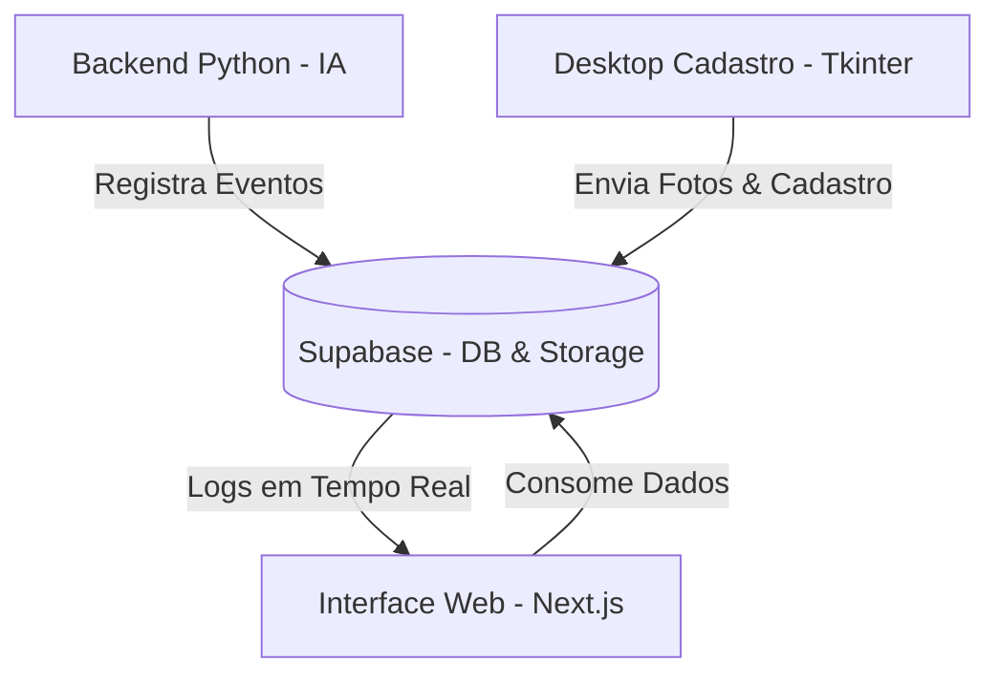

# 🏫 Escola Modelo: Sistema Integrado de Reconhecimento Facial


O **Escola Modelo** é uma infraestrutura de segurança e gestão escolar de ponta, que utiliza **Inteligência Artificial (Visão Computacional)** para automatizar o controle de frequência e segurança de alunos. Com uma arquitetura híbrida (Desktop - Web - Nuvem), o sistema garante precisão, velocidade e uma experiência de usuário premium.

---

## 🏗️ Arquitetura do Projeto

O sistema é dividido em três camadas principais que trabalham em sincronia em tempo real:



### 1. 🖥️ Backend (O Coração da Inteligência)
Localizado na pasta `/backend`, contém a lógica de processamento e persistência:

*   **`reconhecimento.py` (O Sentinela)**: 
    *   Utiliza **OpenCV** e a biblioteca **face_recognition** (baseada em dlib).
    *   Processa frames da webcam em tempo real com redução de escala (0.25x) para garantir performance em qualquer hardware.
    *   Implementa um **cooldown inteligente de 30 segundos** por aluno para evitar registros duplicados por erro de detecção continuada.
    *   Faz a identificação comparando os encodings faciais gerados a partir das fotos locais (`/fotos`).

*   **`database.py` (O Gerenciador de Dados)**:
    *   Camada de abstração para o **Supabase**.
    *   Lida com CRUD de alunos, responsáveis e vínculos.
    *   **Lógica Automática**: Identifica se o aluno está entrando ou saindo baseado no último registro. Se o último registro foi "entrada", o próximo será "saída" automaticamente.

*   **`app_cadastro.py` (Módulo de Onboarding)**:
    *   Interface Desktop construída em **Tkinter**.
    *   Captura uma sequência de **10 fotos** do aluno para treinar a precisão da IA.
    *   Faz o upload automático da foto principal para o **Supabase Storage** e sincroniza os metadados no banco.

---

### 2. 🌐 Frontend (O Centro Administrativo)
Localizado na pasta `/frontend`, desenvolvido com as tecnologias mais recentes do ecossistema React:

*   **Dashboard Moderno**: Visualização de estatísticas através de gráficos do **Recharts**.
*   **Gestão de Alunos**: Lista dinâmica com busca avançada e filtros por série/sala.
*   **Registros de Acesso**: Audit log detalhado de todas as detecções faciais.
*   **Design System**: 
    *   Uso de **Tailwind CSS 4** para performance máxima de estilização.
    *   Componentes **Shadcn UI** customizados com estética de *Glassmorphism*.
    *   **Square Profile UI**: O novo modal de perfil 1:1, nítido e de alta legibilidade, otimizado para administradores.

---

### 3. ☁️ Nuvem (Persistência & Realtime)
*   **PostgreSQL**: Armazenamento relacional dos dados.
*   **Supabase Storage**: Hospedagem das imagens dos alunos com URLs assinadas.
*   **Realtime**: Sincronização instantânea entre as detecções do Backend e a exibição no Dashboard Web.

---

## 🛠️ Passo a Passo para Instalação

### Configuração Inicial
1.  **Clone o repositório**:
    ```bash
    git clone https://github.com/rafaeldominguesdev/Escola-Reconhecimento
    cd Escola-Reconhecimento
    ```

2.  **Configuração do Banco de Dados**:
    *   Crie um projeto no **Supabase**.
    *   Execute o schema SQL (tabelas `alunos`, `responsaveis`, `aluno_responsavel`, `registros`).
    *   Crie um bucket público/privado chamado `fotos-alunos` no Storage.

### Executando o Backend
1.  Navegue até a pasta: `cd backend`
2.  Crie o ambiente virtual: `python -m venv venv`
3.  Ative o ambiente:
    *   Windows: `.\venv\Scripts\activate`
    *   Linux/Mac: `source venv/bin/activate`
4.  Instale as dependências: `pip install -r requirements.txt`
5.  Crie um arquivo `.env` com suas chaves:
    ```env
    SUPABASE_URL=https://sua-url.supabase.co
    SUPABASE_KEY=sua-chave-anon-public
    ```

### Executando o Frontend
1.  Navegue até a pasta: `cd frontend`
2.  Instale os pacotes: `npm install`
3.  Crie um arquivo `.env.local` com as mesmas chaves do backend.

---

## 🚀 Como Usar o Sistema

### 1. Iniciar Tudo (Recomendado)
Na raiz do projeto, execute o script de automação:
```powershell
./start-all.ps1
```
Ou via npm no frontend:
```bash
npm run dev:all
```

### 2. Fluxo de Operação
1.  **Cadastrar Aluno**: Abra o `app_cadastro.py`, insira os dados e capture as fotos.
2.  **Iniciar Monitoramento**: Execute o `reconhecimento.py`. O sistema abrirá a câmera e começará a identificar os rostos.
3.  **Acompanhar no Web**: Abra o Dashboard no navegador (`localhost:3000`) para ver os registros caindo em tempo real.

---

## 🎨 Estética e Experiência do Usuário (UX)

O projeto segue princípios de **"Perfect UI"**:
*   **Contraste Elevado**: Fontes e ícones nítidos para visibilidade clara.
*   **Transições Suaves**: Animações de entrada e hover em todos os cards.
*   **Respondividade**: O dashboard se adapta a diferentes tamanhos de tela.
*   **Square Profile**: Um modal de perfil inovador, focado em clareza extrema e design equilibrado.

---

## 📄 Licença
Este sistema é de uso administrativo exclusivo. Desenvolvido para modernizar a segurança escolar.

**Desenvolvido por [Rafael Fernandes](https://github.com/rafaeldominguesdev)**
