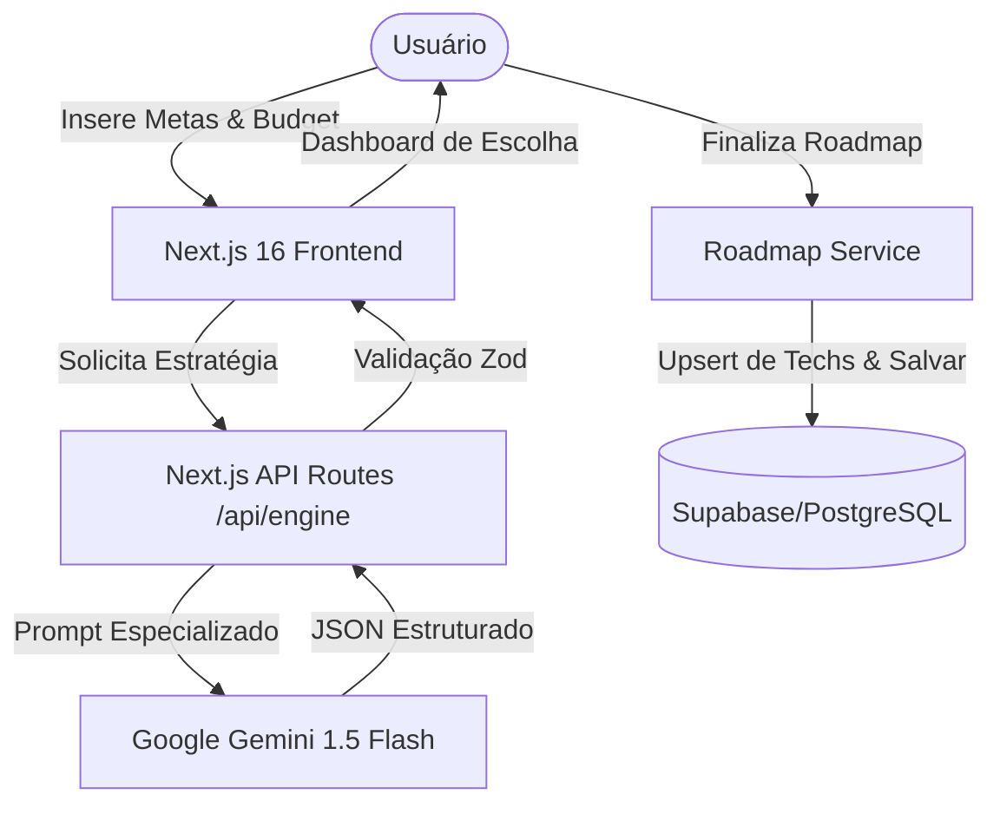

# SID | Sistema Inteligente de Descarbonização


O **SID** é uma plataforma estratégica de alta fidelidade e nível executivo, desenvolvida para os setores de Petróleo, Gás e Refino. Ele permite simular roadmaps complexos de descarbonização (Net Zero 2050) utilizando um motor de IA sensível ao contexto que equilibra restrições de CAPEX/OPEX com metas de redução de emissões.

## 🚀 Principais Funcionalidades

- **SID ENGINE (Estrategista GenAI)**: Integração com o Google Gemini 1.5 Flash utilizando uma base de conhecimento especializada em E&P (CCUS, HISEP, WAG, Closed Flare) e Refino (SAF - Bio-QAV, Hidrogênio Azul/Verde).
- **Matriz de Decisão Dinâmica**: Simulação em tempo real de ciclos de implementação. O algoritmo de "recalculo de rota" da IA ajusta a melhor estratégia técnica com base nas escolhas anteriores e no orçamento restante.
- **Persistência Corporativa**: Camada de armazenamento robusta usando Supabase e PostgreSQL, com Row Level Security (RLS) garantindo a privacidade dos dados por usuário/empresa.
- **Resiliência Offline**: Sistema de diagnóstico de rede integrado que evita a perda de dados e monitora a estabilidade da conexão em tempo real.
- **UX/UI Premium**: Dashboard de nível executivo construído com Tailwind CSS 4 e Framer Motion, apresentando inputs de alta precisão e visualizações de dados estratégicos.

## 🏗 Arquitetura e Fluxo Técnico

A plataforma segue uma arquitetura full-stack moderna com foco em integridade de dados e segurança.



## 🛠 Tech Stack

- **Framework**: [Next.js 16](https://nextjs.org/) (Pages Router)
- **Linguagem**: [TypeScript](https://www.typescriptlang.org/) (Strict Mode)
- **Integração de IA**: [Google Generative AI SDK](https://ai.google.dev/)
- **Estado e Validação**: [Zod](https://zod.dev/) para DTOs e aplicação de esquemas de API.
- **Estilização**: [Tailwind CSS 4](https://tailwindcss.com/) & [shadcn/ui](https://ui.shadcn.com/)
- **Animações**: [Framer Motion](https://www.framer.com/motion/)
- **Banco de Dados / Auth**: [Supabase](https://supabase.com/) (Auth, PostgreSQL, RLS)

## 🛡 Segurança e Boas Práticas

1. **Proxy de Chaves de API**: Nenhuma chave de API é exposta no lado do cliente. Todas as chamadas ao Gemini e à Service Role do Supabase são roteadas através de rotas seguras do servidor Next.js.
2. **Validação de Schema**: Cada resposta da IA é validada por um esquema Zod antes de ser renderizada, evitando quebras na interface por saídas malformadas do LLM.
3. **UI Otimista / Estado**: Implementação de gerenciamento de estado complexo para lidar com ciclos de simulação sem re-renderizações desnecessárias.
4. **Resiliência**: Listeners globais de detecção offline monitoram o status da conexão para proteger o trabalho estratégico não salvo.

## ⚙️ Configuração e Instalação

1. **Clone o repositório**:
   ```bash
   git clone https://github.com/gabrielbersi/s.i.d.git
   cd s.i.d
   ```

2. **Instale as dependências**:
   ```bash
   npm install
   ```

3. **Configure as Variáveis de Ambiente**:
   Crie um arquivo `.env.local` com:
   ```env
   NEXT_PUBLIC_SUPABASE_URL=sua_url_do_supabase
   NEXT_PUBLIC_SUPABASE_ANON_KEY=sua_anon_key
   SUPABASE_SERVICE_ROLE_KEY=sua_service_role_key
   GOOGLE_GENERATIVE_AI_API_KEY=sua_chave_do_gemini
   ```

4. **Inicie em modo de desenvolvimento**:
   ```bash
   npm run dev
   ```

---

Desenvolvido por **Gabriel Bersi** como parte de uma solução estratégica de descarbonização de alta precisão.
